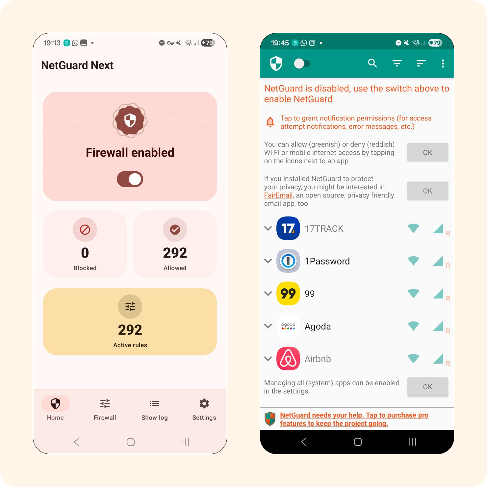
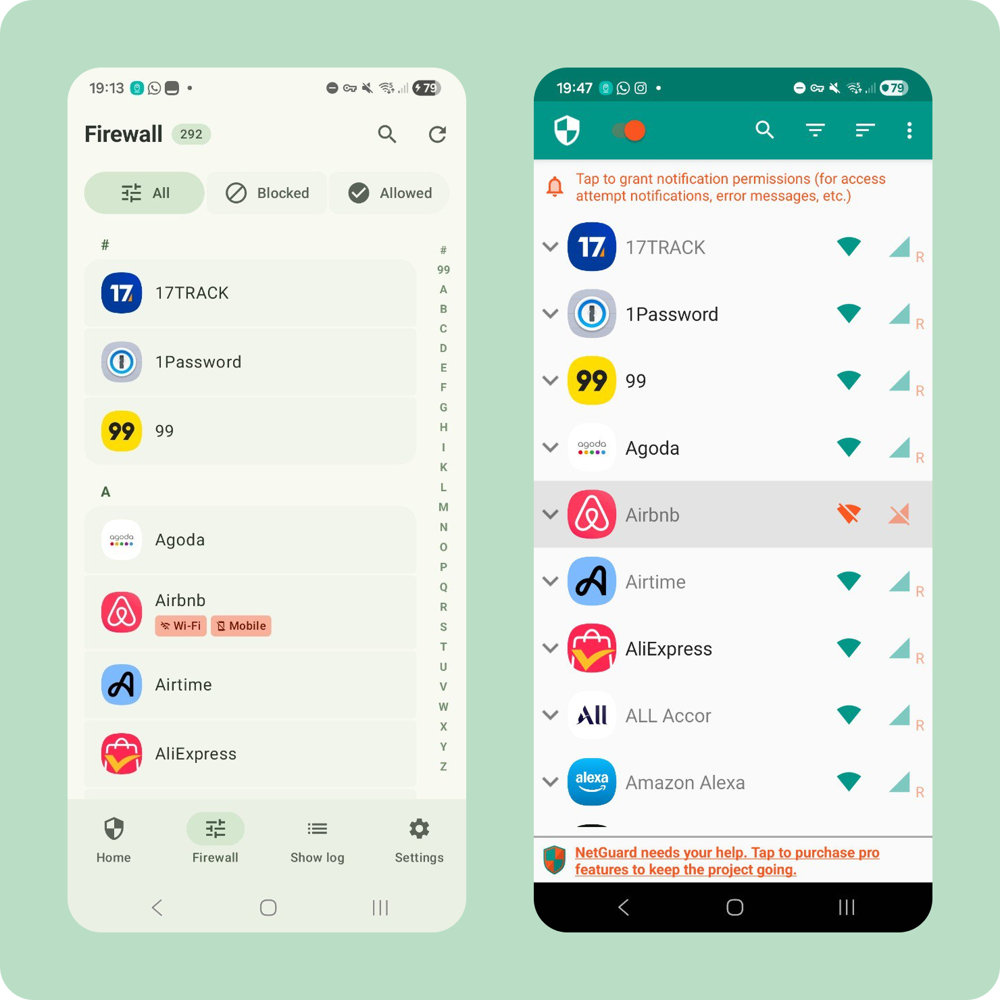
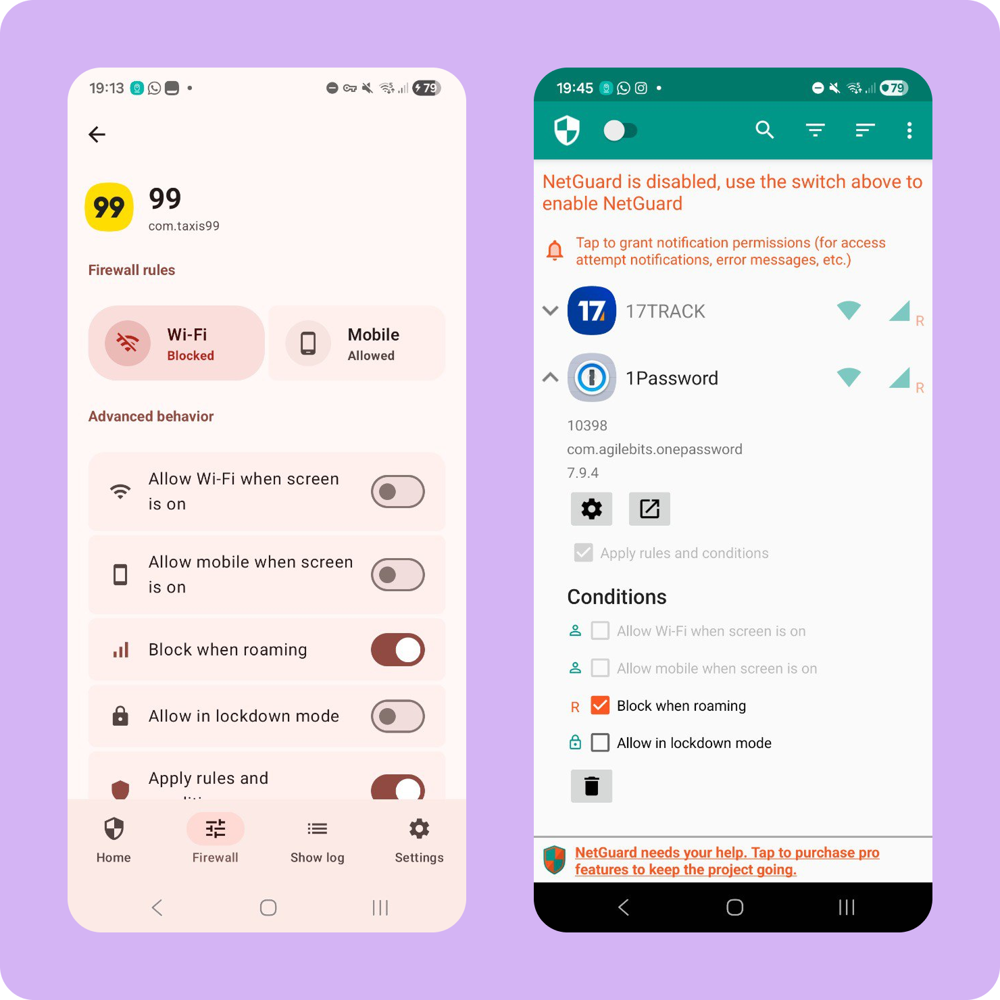

# Re-NetGuard

<p align="center">
  
</p>

<p align="center">
  <strong>Local-first, no-root firewall control with a modern Material 3 experience.</strong><br>
  Built with Kotlin 2.3, Jetpack Compose, and a first-party Android-only architecture.
</p>

<p align="center">
  <a href="https://kotlinlang.org/" target="_blank" rel="noreferrer"></a>
  <a href="https://developer.android.com/compose" target="_blank" rel="noreferrer"></a>
  <a href="LICENSE" target="_blank" rel="noreferrer"></a>
  <a href="#" target="_blank" rel="noreferrer"></a>
</p>

---

**Re-NetGuard** is a modernized fork of [NetGuard](https://github.com/M66B/NetGuard) created by Marcel Bokhorst. It preserves NetGuard’s no-root, VPN-based filtering model and adds a refreshed Material 3 Expressive Android UX with improved workflows for logs, rules, and settings.

## 🚀 Why Re-NetGuard

- **No-root by design**
  - Uses Android `VpnService` with local filtering, no external proxy dependency.
- **UI-first redesign**
  - Material 3 Expressive visuals, cleaner spacing, and improved interaction behavior.
- **Modern navigation**
  - Adaptive patterns for phone and tablet form factors.
- **Safer controls**
  - Clearer toggles, better feedback, and improved update-check visibility.
- **Stronger log clarity**
  - Upgraded traffic timeline views with status, protocol, and app-level context.
- **Localization-aware**
  - Translated update states and expanded language coverage.

## 📸 Screenshots

| Home | Details | App Access |
| :---: | :---: | :---: |
|  |  |  |
| **Settings** |
|  |

## 🛠️ Tech Stack

- **Language:** Kotlin
- **UI:** Jetpack Compose + Material 3 Expressive
- **Architecture:** Compose-first Android app, Hilt DI, coroutine-based workflows
- **Navigation:** Navigation 3 / Adaptive Navigation 3 / Adaptive Navigation Suite
- **Data/State:** DataStore, WorkManager
- **Networking:** OkHttp (where used in platform services)
- **Theming:** Material Kolor for dynamic color and palette handling
- **Native layer:** C++ JNI core for firewall engine
- **Build:** Gradle + Kotlin plugin 2.3.x, Android Gradle Plugin 9.0.1

## 🏗️ Project Structure

- `app/`: Android application module (entry point + UI + services)
- `app/src/main/kotlin/eu/faircode/netguard/ui/`: Compose screen structure and app shell
- `app/src/main/kotlin/eu/faircode/netguard/`: Firewall services and system integration
- `app/src/main/kotlin/eu/faircode/netguard/ui/screens/`: Main screen implementations
- `app/src/main/kotlin/eu/faircode/netguard/ui/main/`: Navigation and host-level UI containers
- `app/src/main/kotlin/eu/faircode/netguard/ServiceSinkhole.kt`: Update checks, background tasks, filtering pipeline
- `app/src/main/jni/netguard/`: Native networking engine

## 🏁 Getting Started

### Prerequisites

- **Android Studio** (current stable)
- **JDK 17+**
- **Android SDK** with API 26+ target device support

### Build

```bash
./gradlew :app:assembleDebug
```

### Run

```bash
./gradlew :app:installDebug
```

### Install from release bundle

You can also build a release variant configured for production checks and shrinker behavior. See your build types in `app/build.gradle.kts`.

## ⚠️ Behavior Notes

- This app is local-first and does not proxy traffic through a third-party backend.
- Some device manufacturers apply stricter VPN policies; behavior can vary across ROMs.
- Certain background/network capabilities depend on notification, battery optimization, and device permissions.

## 🤝 Credits

- Forked from the original [NetGuard](https://github.com/M66B/NetGuard) by Marcel Bokhorst.
- Reworked into **Re-NetGuard** with a modern Compose + Material 3 redesign.

## 📜 License

Re-NetGuard is licensed under **GNU GPLv3**. See [`LICENSE`](LICENSE) for details.
